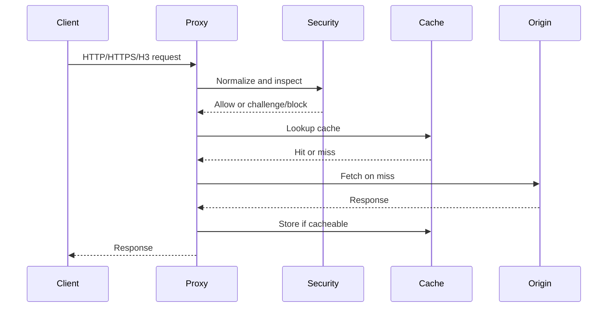

# Edge 请求生命周期

> 文档状态：`draft`  
> Owner：Edge Runtime  
> 最后验证：2026-09-04

```mermaid
sequenceDiagram
  participant C as Client
  participant P as Proxy
  participant S as Security
  participant K as Cache
  participant O as Origin
  C->>P: HTTP/HTTPS/H3 request
  P->>S: Normalize and inspect
  S-->>P: Allow or challenge/block
  P->>K: Lookup cache
  K-->>P: Hit or miss
  P->>O: Fetch on miss
  O-->>P: Response
  P->>K: Store if cacheable
  P-->>C: Response
```

